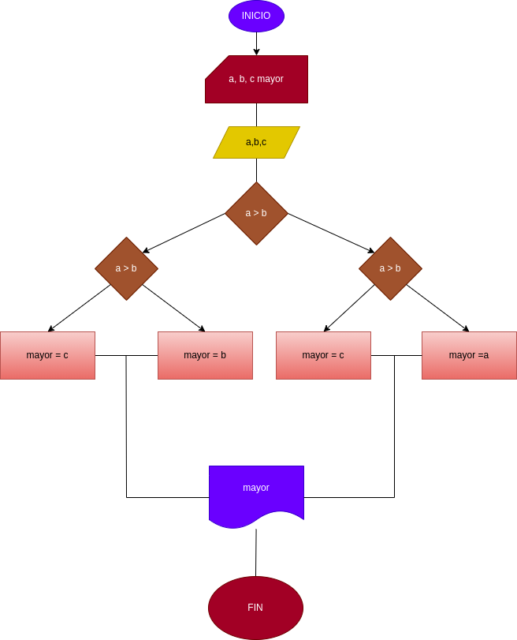

## EJERCICIO 2 ESTRUCTURAS CONDICIONALES 

## Programa para hallar el mayor de tres números enteros 

## ANALISIS

### Definición de variables

* a: primer número 
* b: segundo número 
* c: tercer número 
* mayor: número mayor 

Se comparan los tres valores entre si para hallar el más grande 

## Diseño 

